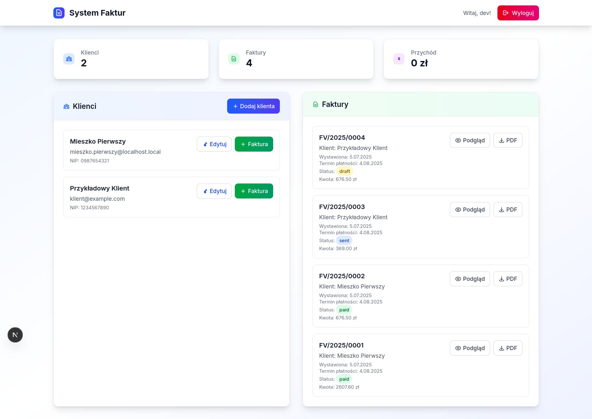

# Invoice System - Monorepo

Modern invoice system built as a monorepo with four JavaScript applications:
- **web-app** (Next.js) - Main application with user interface
- **invoice-worker** (Nest.js) - Worker for generating PDF invoices
- **email-worker** (Express.js) - Worker for sending emails
- **pay-mock** (Express.js) - Mock application for payment simulation



## 🚀 Quick Start

### Requirements
- Node.js 18+
- Docker and Docker Compose
- npm

### Setup

1. **Cloning and installation**
```bash
git clone <repository-url>
cd invoices-poc
npm install
```

2. **Environment setup**
```bash
# Start all containers (PostgreSQL, RabbitMQ)
npm run docker:up

# Start all applications
npm run dev
```

3. **Application access**
- **Main application**: http://localhost:3001
- **Pay Mock**: http://localhost:3003
- **RabbitMQ Management**: http://localhost:15672 (user: invoices_user, password: invoices_password)
- **PostgreSQL**: localhost:5433

### Default login credentials
- **Login**: dev
- **Password**: dev

## 🧪 Testing

### Tests across the entire monorepo
```bash
# All tests
npm run test

# Tests with coverage
npm run test:coverage

# E2E tests
npm run test:e2e
```

### Tests in individual applications
```bash
# Web App
cd apps/web-app && npm test

# Invoice Worker
cd apps/invoice-worker && npm test

# Email Worker
cd apps/email-worker && npm test

# Pay Mock
cd apps/pay-mock && npm test
```

### Test types
- **Unit Tests**: Function and component tests
- **Integration Tests**: API and integration tests
- **E2E Tests**: Full application flow tests (Playwright)

## 📁 Project Structure

```
invoices-poc/
├── apps/
│   ├── web-app/          # Next.js application (App Router + TypeScript)
│   │   ├── app/          # Pages and API routes
│   │   ├── lib/          # Libraries (Prisma, Auth, RabbitMQ)
│   │   ├── prisma/       # Database schema
│   │   ├── __tests__/    # Unit and integration tests
│   │   └── tests/        # E2E tests
│   ├── invoice-worker/    # PDF generation worker
│   ├── email-worker/      # Email sending worker
│   └── pay-mock/         # Payment mock application
├── storage/              # PDF files and uploads
├── assets/               # Resources (fonts, etc.)
├── docker-compose.yml    # Docker configuration
├── turbo.json           # Monorepo configuration
└── package.json         # Main package.json
```

## 🔧 Features

### ✅ Implemented
- **JWT Authentication**: Login with bcrypt password
- **Dashboard**: List of clients and invoices with statuses (draft, sent, paid)
- **Client Management**: Adding and editing clients with change history
- **Invoice Management**: Creating invoices with items in modal editor
- **PDF Generation**: Automatic invoice PDF generation with Polish characters (DejaVu Sans)
- **Email Sending**: Automatic invoice email sending with payment link
- **Payment System**: Mock application for payment simulation with webhook
- **Event-driven**: RabbitMQ for communication between applications
- **Docker**: Complete containerized environment
- **Monorepo**: Turborepo with npm workspaces
- **Testing**: Unit, integration and E2E tests

### 🔄 API Endpoints
- `POST /api/auth/login` - User login
- `GET /api/clients` - Client list
- `POST /api/clients` - Add new client
- `PUT /api/clients/[id]` - Edit client with change history
- `GET /api/invoices` - Invoice list
- `POST /api/invoices` - Create new invoice
- `GET /api/invoices/[id]/pdf` - Download invoice PDF
- `GET /api/invoices/by-token/[token]` - Get invoice by payment token
- `POST /api/payments/webhook` - Payment webhook with signature verification

### 🗄️ Database Model
```sql
User (id, username, passwordHash, createdAt)
Client (id, name, email, nip, createdAt)
Invoice (id, clientId, userId, issueDate, dueDate, invoiceNumber, data, pdfFileName, status, payToken)
ClientChangeLog (id, clientId, userId, changedAt, before, after, field)
```

## 🐳 Docker

### Containers
- **PostgreSQL**: Database (port 5433)
- **RabbitMQ**: Message broker (port 5672, management 15672)

### Docker Commands
```bash
# Start
docker-compose up -d

# Stop
docker-compose down

# Rebuild
docker-compose build

# Logs
docker-compose logs -f
```

## 🛠️ Development

### npm Scripts
```bash
# Start all applications in development mode
npm run dev

# Build all applications
npm run build

# Linting
npm run lint

# Type checking
npm run type-check

# Tests
npm run test
npm run test:coverage
npm run test:e2e

# Docker
npm run docker:up
npm run docker:down
npm run docker:logs
```

### Applications
- **web-app** (port 3001): Next.js with TypeScript, Tailwind CSS, Prisma
- **invoice-worker**: Nest.js worker for PDF generation with pdfkit
- **email-worker**: Express.js worker for sending emails with nodemailer
- **pay-mock** (port 3003): Express.js payment mock with webhook

## 🔄 Application Flow

1. **Invoice Creation**: User creates invoice in web-app with items
2. **Event invoice.created**: Web-app publishes event to RabbitMQ with invoice data
3. **PDF Generation**: invoice-worker receives event and generates PDF with Polish characters
4. **Event invoice.send**: invoice-worker publishes event with generated PDF filename
5. **Email Sending**: email-worker receives event and sends email with PDF and payment link
6. **Status Update**: email-worker updates invoice status to "sent"
7. **Payment**: User clicks link in email and pays through pay-mock
8. **Webhook**: pay-mock sends webhook to web-app with signature
9. **Status "paid"**: Web-app verifies signature and updates invoice status to "paid"

## 🔐 Security

- **Passwords**: bcrypt with salt rounds 10
- **JWT**: 24h expiration with refresh token
- **Webhook signature**: Webhook signature verification (X-PAYMENT-SIGNATURE)
- **CORS**: Properly configured CORS headers for cross-origin requests
- **Database**: Isolated Docker containers
- **Environment variables**: Configuration through .env in each application
- **SQL Injection**: Protection through Prisma ORM

## 📊 Invoice Statuses

- **draft** (yellow): Invoice created, waiting for PDF generation
- **sent** (blue): PDF generated, email sent
- **paid** (green): Payment completed

## 📞 Support

In case of issues:
1. Check logs: `docker-compose logs`
2. Restart containers: `docker-compose restart`
3. Reset database: `docker-compose down -v && docker-compose up -d`
4. Check application status: `npm run dev`
5. Check RabbitMQ: http://localhost:15672
6. Check database: `docker-compose exec postgres psql -U invoices_user -d invoices_db`
7. Check tests: `npm test` 